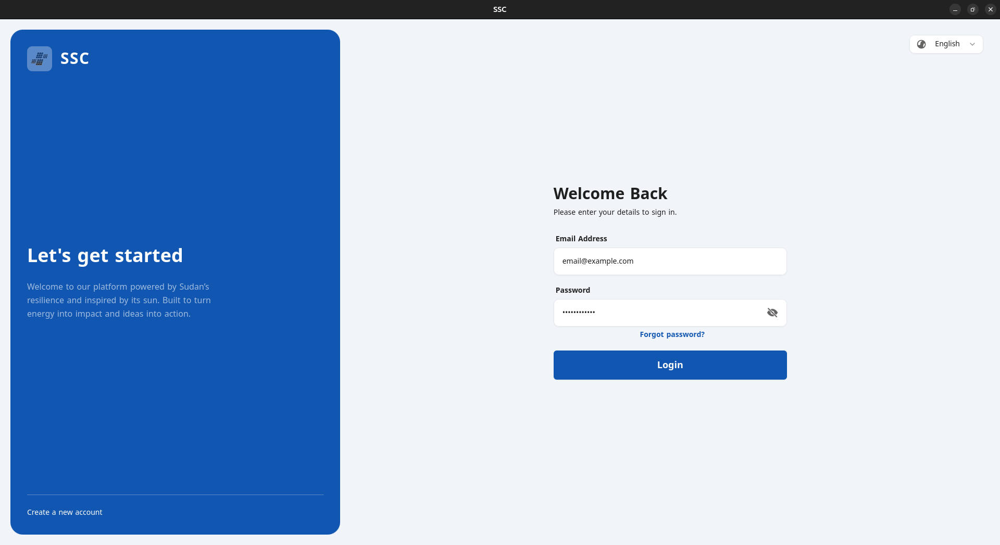
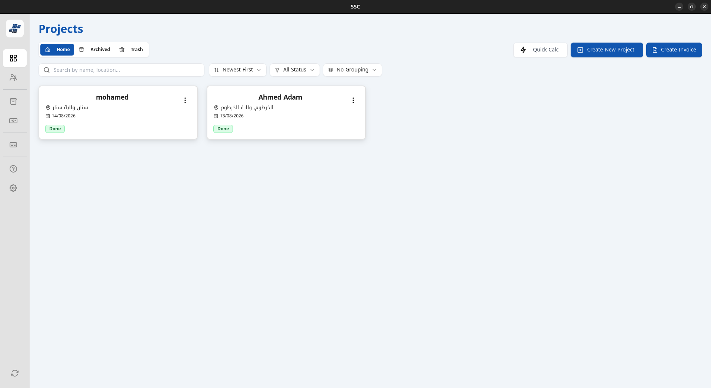
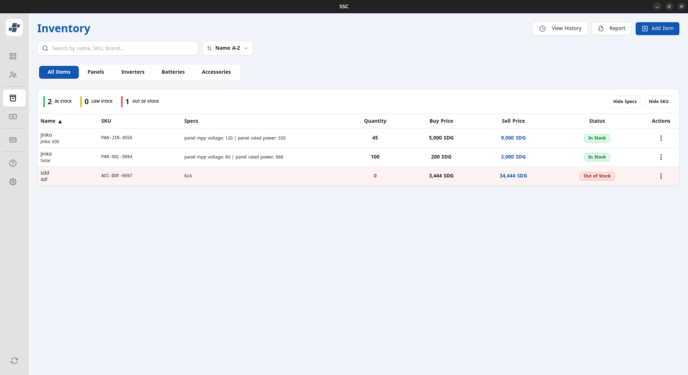
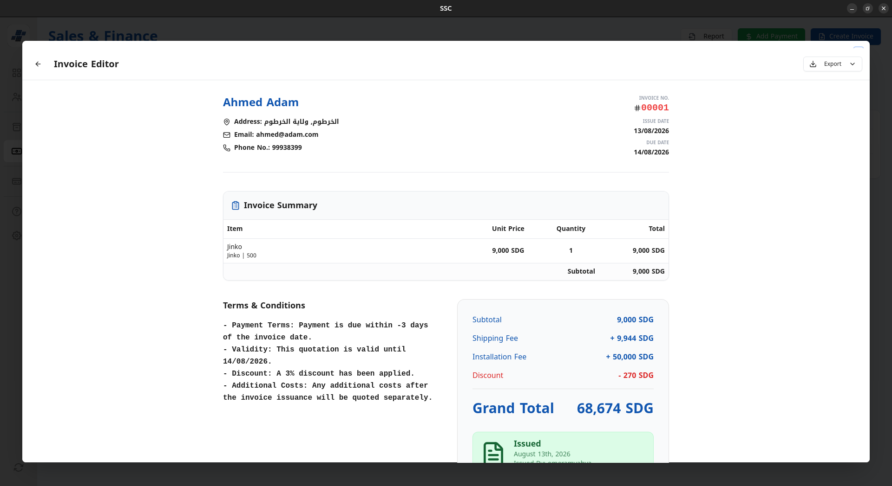
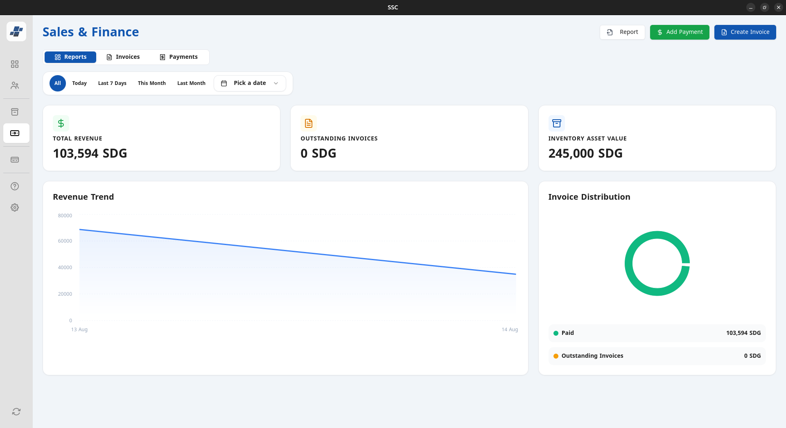
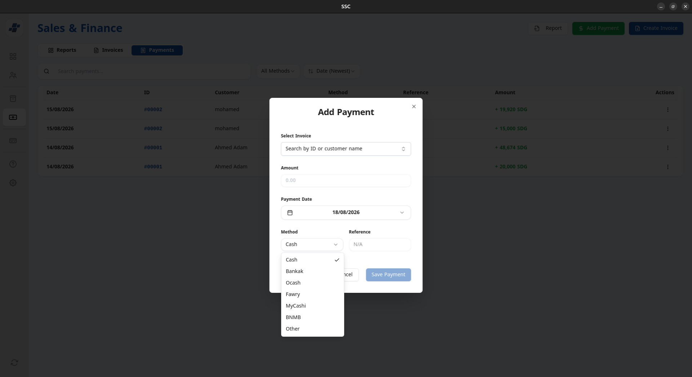
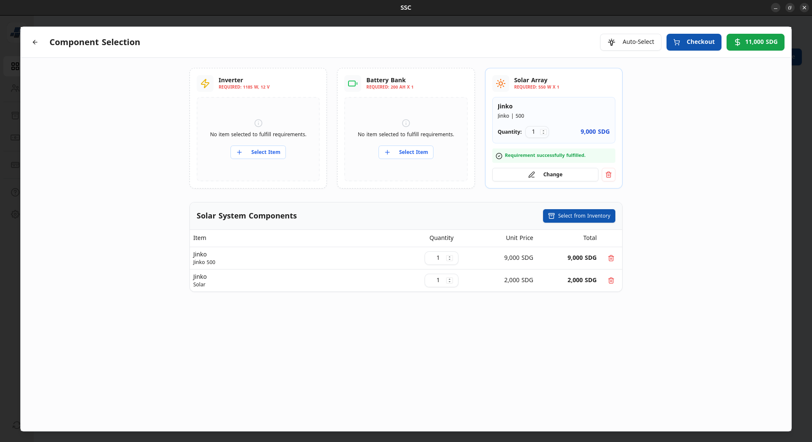

<div align="center">


# SSC — Solar System Calculator

**A professional cross-platform desktop application for solar energy businesses.**
Manage inventory, sales, projects, and automatic solar system configurations — all in one place, with full Arabic & English support.

<br/>

[](https://tauri.app)
[](package.json)
[](#)
[](#)

</div>

---

## 📖 Overview

**SSC (Solar System Calculator)** is a feature-rich desktop application built for solar energy companies and distributors. It streamlines every aspect of the business — from calculating the right solar configuration for a client's electrical needs to issuing invoices and tracking payments — all within a single, bilingual (Arabic/English) interface with full RTL support.

---

## ✨ Features

### ⚡ Automatic Solar System Calculator

Intelligently calculates the optimal solar system configuration based on a client's electrical appliances and consumption. Outputs the recommended number of **solar panels**, **battery capacity**, and **inverter size** — eliminating manual engineering guesswork.

### 📦 Inventory Management

Track all solar products and components in real time. Manage stock levels, product categories, pricing, and supplier information for panels, batteries, inverters, cables, and accessories.

### 🛒 Sales Management

Handle the complete sales lifecycle — from creating quotations to finalizing sales orders. Associate sales with clients, projects, and products with full audit trails.

### 🧾 Invoice Issuance

Generate professional, branded PDF invoices directly from the application. Invoices support bilingual output (Arabic/English) and are automatically populated from sales data.

### 💳 Payments Handling

Record, track, and reconcile client payments against invoices. Monitor outstanding balances, payment history, and generate financial summaries per client or project.

### 📁 Projects Management

Organize work around client projects. Link inventory, sales, invoices, and payments to a specific project for a complete 360° view of each engagement.

### 🏢 Enterprise & Multi-User Management

Support for multiple users with role-based access control. Manage teams, assign permissions, and maintain data integrity across your organization through a centralized Supabase backend.

---

## 🛠️ Tech Stack

### Frontend

[](https://react.dev)
[](https://www.typescriptlang.org)
[](https://vitejs.dev)
[](https://tailwindcss.com)
[](https://www.radix-ui.com)
[](https://www.framer.com/motion)

### Desktop Shell

[](https://tauri.app)
[](https://www.rust-lang.org)

### Backend / Sidecar

[](https://www.python.org)
[](https://flask.palletsprojects.com)
[](https://www.sqlalchemy.org)

### Database & Auth

[](https://supabase.com)
[](https://www.postgresql.org)

### i18n & State

[](https://www.i18next.com)
[](https://zustand-demo.pmnd.rs)
[](https://react-hook-form.com)
[](https://zod.dev)

---

## 🖼️ Screenshots

> Place your screenshots inside `public/screenshots/` and they will appear here.

|                   Login                    |               Projects Dashboard               |
| :----------------------------------------: | :--------------------------------------------: |
|  |  |

|                   Inventory                    |                  Invoices                   |
| :--------------------------------------------: | :-----------------------------------------: |
|  |  |

|                        Finance                        |                   Payments                   |
| :---------------------------------------------------: | :------------------------------------------: |
|  |  |

|                        Components                        |
| :------------------------------------------------------: |
|  |

---

## 🗂️ Project Structure

```
SSC/
├── src/                    # React frontend (TypeScript)
│   ├── components/         # Reusable UI components
│   ├── pages/              # Application pages/views
│   └── ...
├── src-python/             # Python sidecar (Flask + SQLAlchemy)
│   ├── app.py              # Flask entry point
│   └── ...
├── src-tauri/              # Tauri desktop shell (Rust)
│   ├── tauri.conf.json     # App configuration
│   └── ...
├── public/
│   ├── locales/            # i18n translation files (ar / en)
│   └── screenshots/        # App screenshots for README
└── package.json
```

---

## 🚀 Getting Started

### Prerequisites

- [Node.js](https://nodejs.org) (v18+)
- [Rust](https://rustup.rs) (stable toolchain)
- [Python](https://www.python.org) 3.11+
- [Tauri CLI](https://tauri.app/start/prerequisites/) (`npm install -g @tauri-apps/cli`)

### 1. Install Dependencies

```bash
npm install
```

### 2. Build the Python Sidecar

The Python Flask backend runs as a compiled sidecar alongside the app. Build it before launching:

```bash
npm run build:py
```

---

## 💻 Development

### Run in Development Mode (standard)

```bash
npm run tauri dev
```

### Run in Beta Mode

```bash
npm run tauri:beta
```

> This sets `SSC_MODE=beta` and uses the beta Vite config.

### Frontend Only (Vite dev server)

```bash
npm run dev
# or
npm run dev:beta
```

---

## 📦 Building for Production

### Build Frontend + Tauri App (native installer)

```bash
npm run tauri build
```

This compiles the React frontend, bundles the Python sidecar, and packages everything into a native installer for your platform (`.exe` for Windows, `.deb`/`.AppImage` for Linux).

### Frontend Build Only

```bash
npm run build
```

### Lint

```bash
npm run lint
```

---

## 🌐 Internationalization

SSC supports **Arabic (RTL)** and **English (LTR)** out of the box via [i18next](https://www.i18next.com).

Translation files are located in:

```
public/locales/
├── ar/
│   └── translation.json
└── en/
    └── translation.json
```

---

## 📄 License

This is a proprietary application. All rights reserved.

---

<div align="center">
  Built with ❤️ using <a href="https://tauri.app">Tauri</a> & <a href="https://react.dev">React</a>.
</div>
